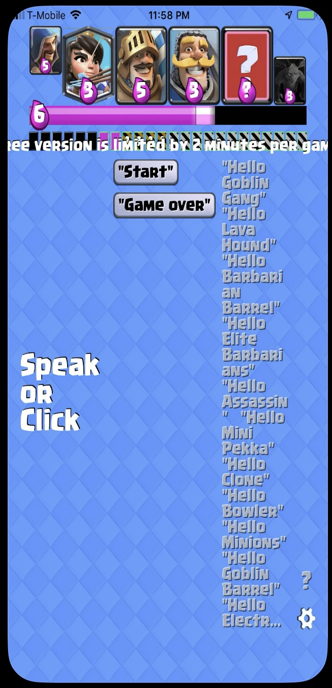

## Clash Royale Assistant (iOS & Android)

As a ‘Clash Royale’ fan, I was always wishing that I could be aware of what cards are in my opponent’s hands at any moment in a game. So I designed and created this app for both **iOS** and **Android**, with native UI frameworks and my homebrew cross-platform **C++** **OpenGL(ES)** rendering engine, combining with 3rd-party **ASR(Automatic Speech Recognition)** library.

The app is basically controlled by user’s voice: 
1. As the game starts, you can say ‘start’ to let the app start tracking the other’s card deck. 
2. When the opponent plays a card, you just speak out the name of the card, preceding with a set triggering words such like “Hello”/“Here comes”, etc., then the app will record the card and show it in the deck region. 
3. As the game goes on, the deck is showing you with current available cards the opponent has in hands, taking into account the current estimated amount of “Elixir”, greatly enhancing your awareness of the battlefield.


``` ```
### What Did I Do
- Use a **Python script** to fetching image assets of ‘Clash Royale’ from SuperCell’s user content website
- Implement a lightweight 2D **rendering engine** and animation system with **OpenGL(ES)** written in **C++**, which can easily be cross-platform for both **iOS** and **Android**(with **NDK**). Use this homebrew rendering engine to render the main animation interface of the app
- Use native UI components on iOS and/or Android for other non-common UI parts
- Integrate a 3rd-party **ASR(Automatic Speech Recognition)** library into the app for the speech control function

``` ```
### Tech Sets
OpenGL(ES), ASR(Automatic Speech Recognition, with 3rd-party library), UIKit, CoreGraphics

``` ```
### Download It Here
[https://apps.apple.com/us/app/cr-card-agent-lite/id1440109172](https://apps.apple.com/us/app/cr-card-agent-lite/id1440109172)


