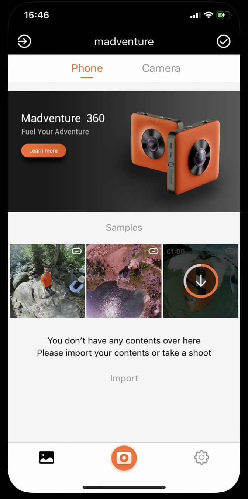

## MADVenture 360 (Mi Sphere Camera) APP

The app controls your “MADV360 / Mi Sphere Camera” to take 360-degree panoramic videos and photos. 
- Receive live video streaming from the camera via RTSP
- Download captured videos and/or photos from the camera via WiFi with TCP/IP protocol
- Convert raw dual fisheye contents captured by the camera into stitched 360-degree panoramic videos and/or photos
- Enable you to review, enhance/edit panoramic contents in various perspective modes. 
- Share your amazing panoramic content to popular social media platforms

``` ```
### What Did I Do
- **Lead the mobile software development team** to build both the **iOS** and **Android** versions. Decide the tech sets we use such like **React Native** for the UI and **OpenGL(ES)** in C++ for graphics processing and rendering
- Construct from-scratch the panoramic video/photo stitching & rendering framework
- Implement the fundamental infrastructure of the **TCP/IP(socket)** communication module for the app
- **Innovate** and implement some ideas about both new features and problem solutions, such like **facial beautifying filters**, completely free panorama control and **shader hot-fixing function**
- Collaborate with the firmware and CV research team in working out some distinguishing features such like auto video stabilization

``` ```
### Tech Stack
OpenGL(ES), GLSL, GPUImage, TCP/IP socket, CoreData/SQLite, AFNetworking, UIKit, React Native, AVFoundation, CoreMotion, CoreVideo, CoreAudio, CoreGraphics, OpenCV, Mesa

``` ```
### Download It Here
[https://apps.apple.com/us/app/madventure-360/id1305533031](https://apps.apple.com/us/app/madventure-360/id1305533031)


